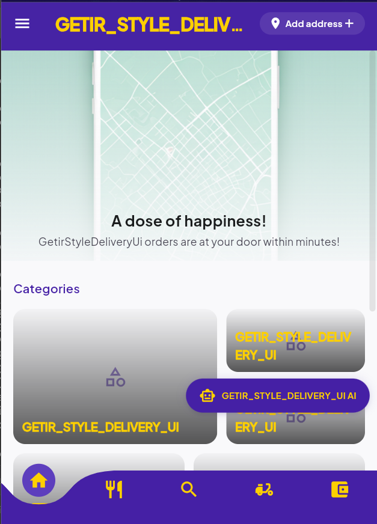
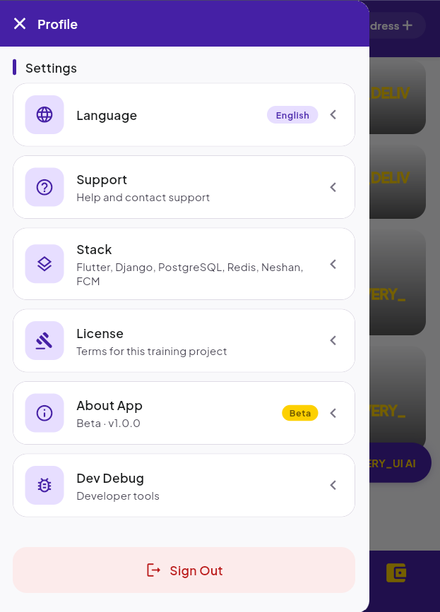
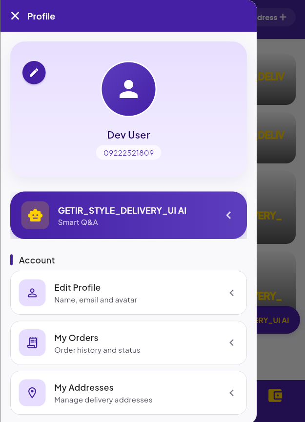
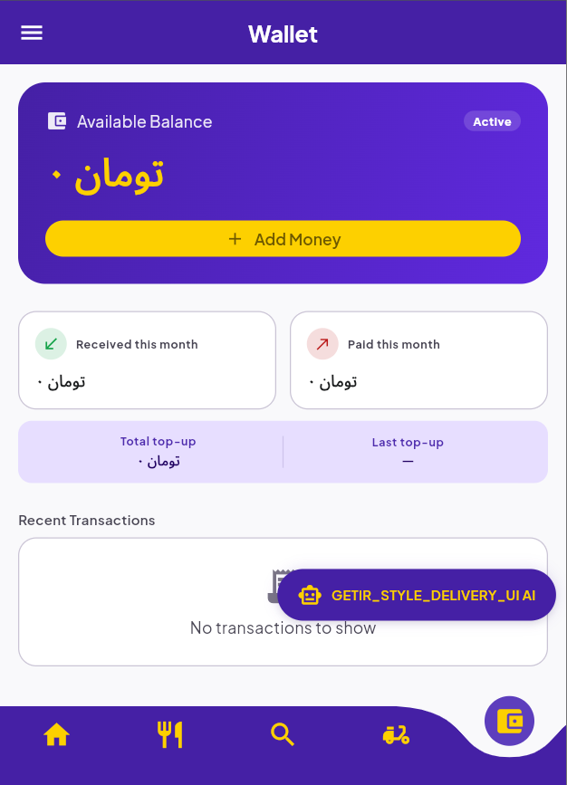
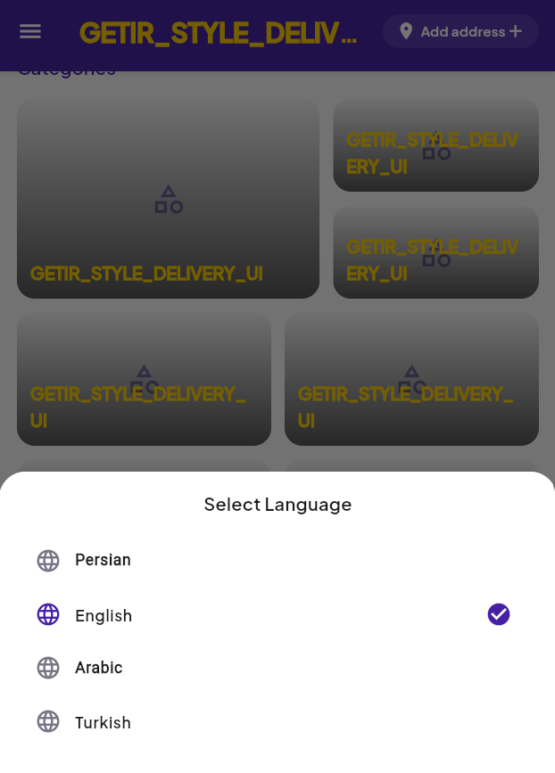
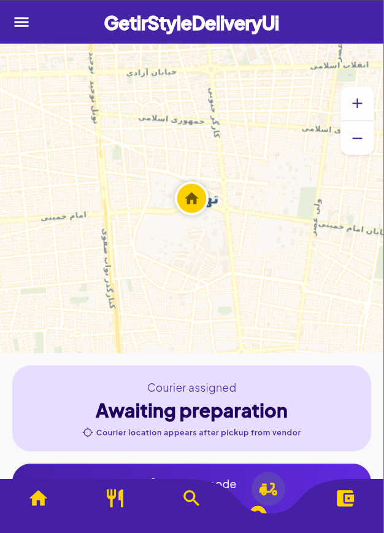
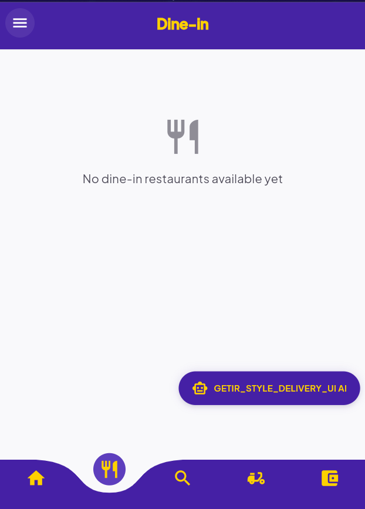
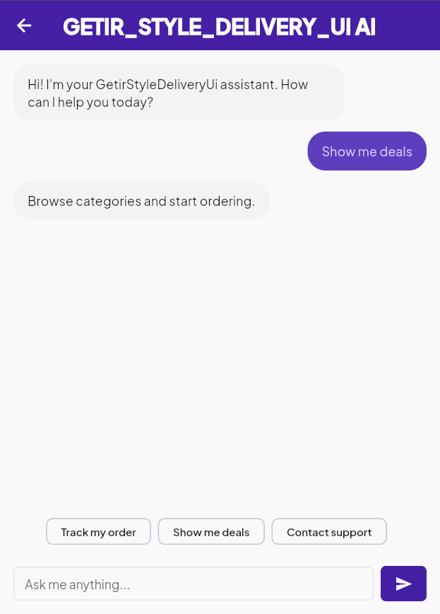
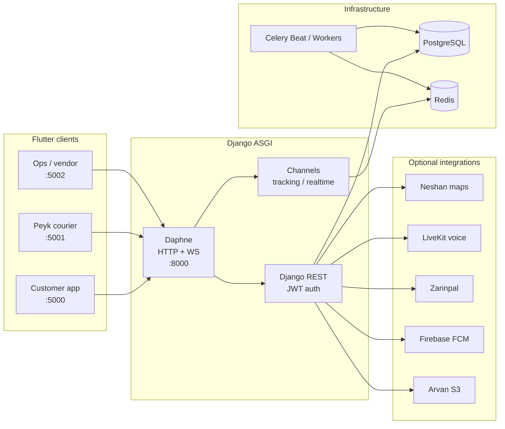

# GETIR_STYLE_DELIVERY_UI

<p align="center">
  <strong>Getir-style multi-app on-demand delivery platform</strong><br/>
  Customer · Courier · Ops · Django ASGI backend
</p>

<p align="center">
  
  
  
  
  
  
</p>

---

> **Training project only.**  
> This repository is published for **education, practice, and portfolio review**.  
> Using it for a business, production product, white-label, or any commercial purpose is **prohibited** and **not ethical**.  
> See [`LICENSE`](./LICENSE) for full terms.

---

## Overview

**GETIR_STYLE_DELIVERY_UI** is a full-stack, Getir-inspired delivery system with three Flutter clients and one Django Channels (ASGI) backend. It covers OTP auth, catalog browsing, cart & checkout, live order tracking, wallet, dine-in, courier tools, and operator/vendor consoles — with RTL-first localization (Persian, Arabic, Turkish, English).

| Client | Package | Role | Default port |
|--------|---------|------|--------------|
| Customer | `frontend/getir_style_delivery_ui_v2` | Shop, order, track, wallet, dine-in | `5000` |
| Peyk (Courier) | `frontend/getir_style_delivery_ui_peyk` | Accept jobs, navigate deliveries, voice | `5001` |
| Ops | `frontend/getir_style_delivery_ui_ops` | Operator & vendor dashboard | `5002` |
| Backend API | `getir_style_delivery_ui_backend` | REST + WebSocket (Daphne) | `8000` |

---

## UI screenshots

Customer app screens from [`frontend/Screens`](./frontend/Screens).

### Home

<p align="center">
  
</p>

### Core flows

<table>
  <tr>
    <td align="center" width="25%">
      <br/>
      <sub><b>Menu drawer</b></sub>
    </td>
    <td align="center" width="25%">
      <br/>
      <sub><b>Profile</b></sub>
    </td>
    <td align="center" width="25%">
      <br/>
      <sub><b>Wallet</b></sub>
    </td>
    <td align="center" width="25%">
      <br/>
      <sub><b>Language</b></sub>
    </td>
  </tr>
  <tr>
    <td align="center" width="25%">
      <br/>
      <sub><b>Order tracking</b></sub>
    </td>
    <td align="center" width="25%">
      <br/>
      <sub><b>Dine-in</b></sub>
    </td>
    <td align="center" width="25%">
      <br/>
      <sub><b>AI assistant</b></sub>
    </td>
    <td align="center" width="25%"></td>
  </tr>
</table>

| Screen | File |
|--------|------|
| Home | [`home.png`](./frontend/Screens/home.png) |
| Menu drawer | [`menu-drawer.png`](./frontend/Screens/menu-drawer.png) |
| Profile | [`profile.png`](./frontend/Screens/profile.png) |
| Wallet | [`wallet.png`](./frontend/Screens/wallet.png) |
| Language | [`language-selection.png`](./frontend/Screens/language-selection.png) |
| Order tracking | [`order-tracking.png`](./frontend/Screens/order-tracking.png) |
| Dine-in | [`dine-in.png`](./frontend/Screens/dine-in.png) |
| AI assistant | [`ai-assistant.png`](./frontend/Screens/ai-assistant.png) |

---

## Architecture



---

## Repository structure

```text
GETIR_STYLE_DELIVERY_UI/
├── README.md
├── LICENSE                          # Proprietary non-commercial
├── .gitignore
├── run_backend.bat                  # API @ :8000
├── run_frontend.bat                 # Customer web @ :5000
├── run_peyk.bat                     # Courier web @ :5001
├── run_ops.bat                      # Ops web @ :5002
├── run_dev.bat                      # Backend + customer together
│
├── frontend/
│   ├── Screens/                     # UI screenshots (README gallery)
│   ├── getir_style_delivery_ui_v2/  # Customer (main UI)
│   ├── getir_style_delivery_ui_peyk/# Courier
│   └── getir_style_delivery_ui_ops/ # Operator / vendor
│
└── getir_style_delivery_ui_backend/
    ├── apps/                        # Domain modules
    ├── config/                      # Django settings + ASGI
    ├── requirements/                # base / development / beta / production
    ├── docs/API.md                  # API reference
    └── manage.py
```

### Backend apps (`getir_style_delivery_ui_backend/apps/`)

| App | Responsibility |
|-----|----------------|
| `accounts` | Users, OTP, roles, profiles |
| `catalog` | Categories, vendors, items, dine-in tables |
| `orders` | Cart → checkout → order lifecycle |
| `delivery` | Courier assignment & delivery state |
| `tracking` | Live location, map tiles proxy, Neshan |
| `wallet` | Balance & ledger |
| `payments` | Payment flows (e.g. Zarinpal) |
| `communications` | Realtime / voice session hooks |
| `notifications` | Push (Firebase when configured) |
| `operators` | Ops-facing APIs |
| `ai_services` | Assistant endpoints |
| `reports` | Reporting |
| `developer` | Dev tools / kill-switch helpers |

### Customer app features (`getir_style_delivery_ui_v2/lib/features/`)

`splash` · `auth` · `home` · `search` · `categories` · `catalog` · `cart` · `address` · `tracking` · `wallet` · `dine_in` · `promotions` · `ai_chat` · `profile` · `debug`

---

## Versions

Verified on the author’s training machine (Windows). Pin ranges in lock/requirement files may allow nearby versions.

| Layer | Version / constraint |
|-------|----------------------|
| **Flutter** | `3.38.9` |
| **Dart SDK** | `3.10.8` (customer/peyk: `^3.9.2`, ops: `^3.10.8`) |
| **App version** | `1.0.0+1` (all three Flutter apps) |
| **Python** | `3.11` |
| **Django** | `5.2.x` (`Django>=5.0,<6.0`) |
| **DRF** | `>=3.15` |
| **Channels / Daphne** | `channels[daphne]>=4.1` |
| **Celery** | `>=5.3` (+ `django-celery-beat`) |
| **Redis client** | `>=5.0` |
| **PostgreSQL driver** | `psycopg2-binary>=2.9` |

---

## Tech stack

### Mobile / web clients (Flutter)

| Area | Stack |
|------|--------|
| UI | Material 3, custom design tokens, `shadcn_ui` (customer) |
| State | `provider` |
| HTTP | `dio` |
| Auth storage | `flutter_secure_storage` |
| Maps | `flutter_map`, Neshan tile/proxy via backend |
| Realtime | `web_socket_channel`, LiveKit (`livekit_client`) |
| i18n | `flutter_localizations` + ARB (`fa` · `en` · `ar` · `tr`) |
| Fonts | `google_fonts`, `persian_fonts` |
| Media | `cached_network_image`, `panorama` (dine-in) |
| Location | `geolocator`, `permission_handler` |

### Backend (Django)

| Area | Stack |
|------|--------|
| API | Django REST Framework + SimpleJWT |
| ASGI | Daphne + Django Channels |
| Jobs | Celery + Redis + django-celery-beat |
| DB | PostgreSQL |
| Admin | django-unfold |
| CORS / static | django-cors-headers, whitenoise |
| Optional | LiveKit API, Firebase Admin, Zarinpal, Arvan S3, Neshan |

---

## Local setup

### Prerequisites

- Flutter SDK **3.38+** (Dart **3.10+**)
- Python **3.11+**
- PostgreSQL & Redis (recommended for full features)
- Windows launchers below assume a venv at `getir_style_delivery_ui_backend/.venv`

### Backend

```powershell
cd getir_style_delivery_ui_backend
python -m venv .venv
.\.venv\Scripts\activate
pip install -r requirements\development.txt
copy .env.example .env
# edit .env — never commit real secrets
python manage.py migrate
python -m daphne -b 0.0.0.0 -p 8000 config.asgi:application
```

Or from repo root:

```powershell
.\run_backend.bat
```

- API: `http://127.0.0.1:8000/api/v1/`
- Admin: `http://127.0.0.1:8000/admin/`
- WebSocket: `ws://127.0.0.1:8000/ws/`
- API docs (markdown): [`getir_style_delivery_ui_backend/docs/API.md`](./getir_style_delivery_ui_backend/docs/API.md)

### Flutter apps

```powershell
cd frontend\getir_style_delivery_ui_v2
flutter pub get
flutter run -d chrome --web-port 5000
```

Convenience scripts (repo root):

| Script | App | Port |
|--------|-----|------|
| `run_frontend.bat` | Customer | `5000` |
| `run_peyk.bat` | Courier | `5001` |
| `run_ops.bat` | Ops | `5002` |
| `run_dev.bat` | Backend + customer | `8000` + `5000` |

In debug, clients talk to `http://127.0.0.1:8000/api/v1` (Android emulator: `10.0.2.2`).

---

## Configuration notes

- Copy [`getir_style_delivery_ui_backend/.env.example`](./getir_style_delivery_ui_backend/.env.example) → `.env`.
- Keep secrets out of git (`.env`, credentials, API keys).
- Firebase, LiveKit, Zarinpal, Arvan S3, and Neshan are **optional**; the API can start without them (some features degrade gracefully).
- This repo ships **placeholder branding** (no production logo) and **no pre-filled personal phone numbers**.

---

## Localization

Customer app ARB locales:

| Code | Language |
|------|----------|
| `fa` | Persian (RTL) |
| `en` | English |
| `ar` | Arabic (RTL) |
| `tr` | Turkish |

---

## License & ethics

**Not open source.** Source is available for viewing and non-commercial training under the proprietary license in [`LICENSE`](./LICENSE).

| Allowed | Not allowed |
|---------|-------------|
| Personal study & learning | Business / commercial use |
| Educational evaluation | Selling, white-labeling, SaaS |
| Non-commercial research | Competing production products |

Commercial use without a separate written agreement is prohibited. Unauthorized commercial use may constitute copyright infringement.

---

## Author

Training / portfolio repository — **[DanixMP](https://github.com/DanixMP)**  
Remote: [github.com/DanixMP/Getir_Style_Delivery_UI](https://github.com/DanixMP/Getir_Style_Delivery_UI)

---

<p align="center">
  <sub>Built for learning · Not for production business use</sub>
</p>
